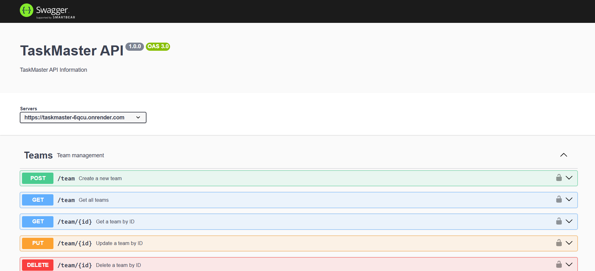
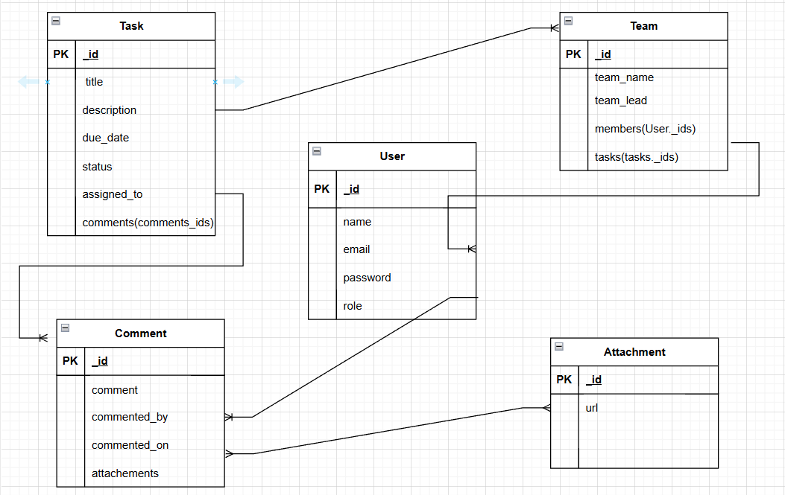

# TaskMaster
TaskMaster: A Collaborative Task Tracking System

For API Documentation visit : https://taskmaster-6qcu.onrender.com/api-docs

Task Master ERD

The "Project Manager" role is assigned directly through the database interface. This ensures that only individuals with access to the database UI can update the "Project Manager" role, maintaining strict control over this critical role assignment.

A user can create a new account so that he/she can access the task tracking platform.

A user can log in to his/her account securely using his/her credentials.

A user can view his/her profile and update his/her personal information.

A task can be created by PM or TL inside a team. (TL should be member of the team where task is created).

A user can view a list of all tasks assigned to him/her.

A PM or TL can mark a task as completed when the task is finished.

PM or TL can assign a task to a team member.

A user can filter tasks based on their status (e.g., incomplete, completed).

A user can search for tasks by title or description.

A user can collaborate with team members by adding comments and attachments to tasks.

A team can be created by Project Manager.

Project Manager will assign a team member as Team Lead.

A team can be updated and deleted only by PM or TL.

A user can securely log out of his/her account when he/she done using the platform.

